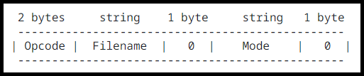

# Synthesys Practical Work – TFTP Client (FRANCILLONNE Radji/GAMIETTE David)
Objectives : Develop a TFTP client using RFC specifications and Wireshark captures.

## Q1) Use command-line arguments for the gettftp and puttftp programs to obtain request information (server and file)
We use the `argv` passed as an argument to the main function to retrieve the arguments for the `gettftp` and `puttftp` programs.

## Q2) Call getaddrinfo to obtain the server’s address
```c
getaddrinfo(hostname, NULL, &hints, &res);
```
In our scenario, `hints` is the configured address. `res` is the result and points to it.

## Q3) Reserve a connection socket to the server
The `socket(AF_INET, SOCK_STREAM, IPPROTO_TCP)` function reserves a socket and establishes a connection to the desired server.
`AF_INET` specifies IPv4, while `SOCK_STREAM` and `IPPROTO_TCP` indicate TCP mode.

## Q4) For gettftp : build a properly formed Read Request (RRQ) and send it to the server, receive a file consisting of a single Data (DAT) packet and its acknowledgment (ACK), receive a file consisting of multiple Data (DAT) packets and their respective acknowledgments (ACK)
For an RRQ (Read Request) request, we want to send a message in the following format:



The OpCode is set to 1 to send a read request and 2 for a write request (relevant for puttftp).
The Mode is set to netascii in our case. Alternatively, it can be set to octet, for example, indicating the transfer mode.
Additionally, the `recv()` function will be used for the reception process.
It is important to use `close(sockfd)` to terminate the process and `freeaddrinfo()` to release the allocated memory.

## Q5) For puttftp : build a properly formed Write Request (WRQ) and send it to the server, send a file consisting of a single Data (DAT) packet and receive its acknowledgment (ACK), send a file consisting of multiple Data (DAT) packets and receive their respective acknowledgments (ACK)
The structure of the puttftp function remains identical to gettftp, with the only difference being the OpCode set to 2 for a write operation. The use of `write()` to send the request is still present, along with the other functions used.
